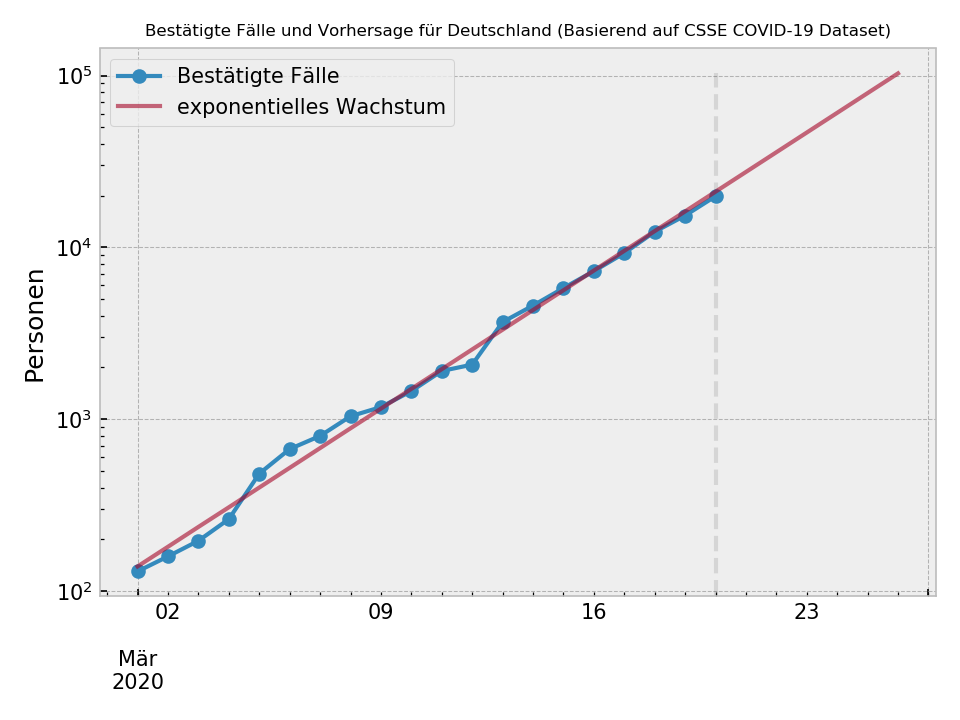

# COVID-19 Prediction Germany

Die entscheidende Frage bei der Beurteilung aller Maßnahmen ist, ob das exponentielle Wachstum verlangsamt worden ist, d.h. die exponentielle Wachstumskurve abflacht. Dazu macht man am besten anhand bestehender Daten ein Modell-Fit und schaut, ob aktuelle Fallzahlen das Modell überschreiten oder man mit den Fallzahlen darunter bleibt.



Siehe NRD Podcast mit Prof. Drosten [#18 - Die Wirksamkeit von Ausgangssperren ist unklar](https://www.ndr.de/nachrichten/info/18-Coronavirus-Update-Die-Wirksamkeit-von-Ausgangssperren-ist-unklar,podcastcoronavirus148.html).

## Datenbasis

Die Daten werden aus dem [2019 Novel Coronavirus COVID-19 (2019-nCoV) Data Repository by Johns Hopkins CSSE](https://github.com/CSSEGISandData/COVID-19) geladen. Mit den Ansteckungszahlen wird ein exponentielles Modell trainiert, welches die Daten optimal abbildet. Damit werden Vorhersagen zur Verbreitung in den nächsten Tagen getroffen.

## Usage

Um eine neue Vorhersage zu generieren, einfach

`python3 predict.py`

ausführen und eine neue Abbildung wird erstellt, sowohl als `.png` als auch als [/html/index.html](/html/index.html). Eine Excel Tabelle mit täglicher Vorhersage sowie das angelernte Modell wird nach Datum sortiert ebenfalls generiert.

Eine interaktive Abbildung ist unter https://cbcity.de/covid/ zu finden

### Serve the (static) Figure

```
docker build -t webserver .
docker run -it -v $(pwd)/html/index.html:/usr/share/nginx/html/index.html -p 80:80 webserver
```

### Requirements

* Pandas
* SciKit-Learn
* Bokeh (für HTML)