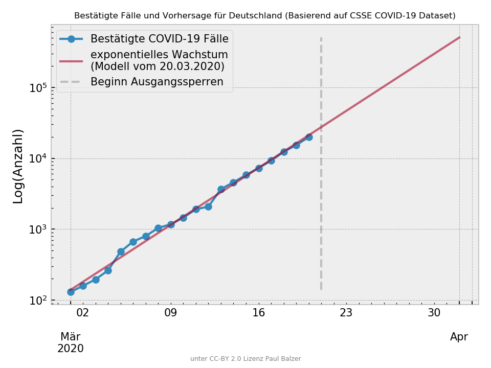

# COVID-19 Prediction Germany

Die entscheidende Frage bei der Beurteilung aller Maßnahmen ist, ob das exponentielle Wachstum verlangsamt worden ist, d.h. die exponentielle Wachstumskurve abflacht. Dazu macht man am besten anhand bestehender Daten ein Modell-Fit und schaut, ob aktuelle Fallzahlen das Modell überschreiten oder man mit den Fallzahlen darunter bleibt.



## Datenbasis

Die Daten werden aus dem [2019 Novel Coronavirus COVID-19 (2019-nCoV) Data Repository by Johns Hopkins CSSE](https://github.com/CSSEGISandData/COVID-19) geladen.

Um eine neue Vorhersage zu generieren, einfach

`python3 predict.py`

ausführen und eine neue Abbildung wird erstellt, sowohl als `.png` als auch als [/html/index.html](/html/index.html). Eine Excel Tabelle mit Vorhersage sowie das angelernte Modell wird nach Datum sortiert ebenfalls generiert.

## Serve the (static) Figure

```
docker build -t webserver .
docker run -it -v $(pwd)/html/index.html:/usr/share/nginx/html/index.html -p 80:80 webserver
```
Now open your Browser and open http://localhost/

### Requirements

* Pandas
* SciKit-Learn
* Bokeh (für HTML)